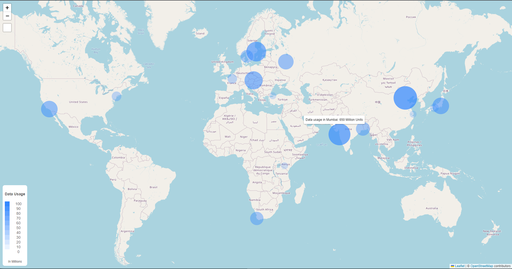

# React Interactive Map
An interactive and responsive map made with Leaflet, React, and supporting libraries. <br>
This is how the final result looks: <br><br>
<br><br>
------
## Steps to run the project
* Download the zip file or clone the repository.
* Open 2 terminals in the project's root folder.
* In one of the terminals, run the following sequence of commands:
```
cd server
npm install
npm run dev
```
* This should start the backend server on port 3000.
* This server contains the data (augmented with coordinates and additional entries)
* In the other terminal, run the following sequence of commands:
```
cd frontend
npm install
npm run dev
```
* This should install the necessary packages and run a dev server on localhost:5173 which is the frontend
* The map should be working at this stage. There is loading logic to prevent errors from null objects before fetching and mounting, but in case of unforseen errors, a refresh should work to fix the problem.
<br>
Frontend only has been deployed at: <a href="https://react-interactive-map.vercel.app/>https://react-interactive-map.vercel.app/</a>
